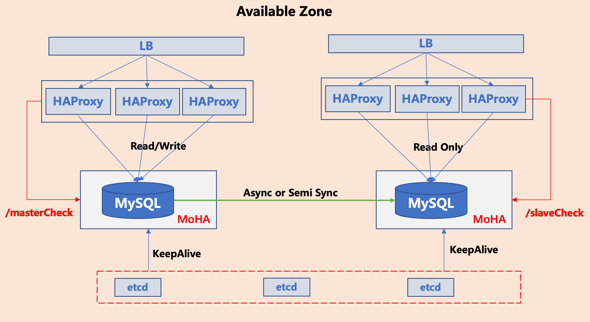
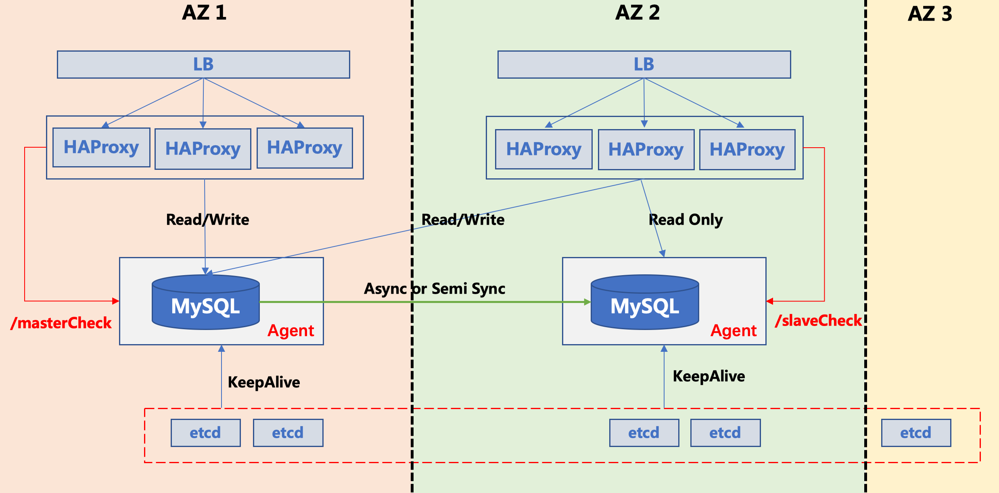

[](https://travis-ci.org/moiot/moha)
[](https://goreportcard.com/report/github.com/moiot/moha)
[](https://opensource.org/licenses/Apache-2.0)

### 什么是 Mobike High Availability（MoHA）？

通过自动的 master 失败检测和秒级的主从切换，MoHA 提供了跨数据中心的 MySQL 集群的高可用（HA）。它的特点包括：


- __高可用__

    MoHA 对 MySQL 的失败检测和 failover 策略可以保证 MySQL 集群的高可用
    
- __无脑裂__

    MoHA 采用 lease 机制，通过配置合理的 lease 长度，可以确保 MySQL 集群无脑裂
    
- __跨数据中心__

    MoHA 采用 etcd 实现服务的注册和发现，避免了 VIP 的局限，可以搭建**跨数据中心**的 MySQL 集群         
 
- __一主多从__

    MoHA 支持搭建一主多从的 MySQL 集群，并且在 Failover 时会指定数据最新的从库作为新主
  
- __单主模式__ 

    在集群内只有一个 MySQL 节点存活时，即使 MoHA 与 etcd 通信中断，单节点 MySQL 依然可以提供服务。
    单主模式支持自动进入和自动退出 
     
- __计划内的主从切换__

    除了 master 节点不可用时自动触发的主从切换外，MoHA 也提供了计划内的手工触发主从切换功能  

__已在摩拜生产环境使用__

### 业界类似方案比较

|功能 |MoHA|	MHA|PXC|MGR|
|:-------|--------     |--------     |--------     |:--------     |
|管理节点|分散|集中|分散|分散|
|故障切换次数|多次|1次|容忍少数节点故障|容忍少数节点故障|
|计划内切换接口|支持|支持|不需要|不需要|
|多中心部署|友好|不友好|不友好/影响性能|不友好/影响性能|
|GTID|支持|高版本|支持|支持|
|proxy|自动感知，无需重启|事件触发并重启|无需重启|无需重启|
|多实例部署|友好|不友好|不友好|友好|
|存在问题| |管理单节点/VIP|锁问题/pxc脑裂/部署麻烦|不成熟/不支持外建/多中心不友好|


### Quick Start


#### 生产环境运行
Docker image is already available on [Dockerhub](https://cloud.docker.com/u/moiot/repository/docker/moiot/moha)

最新版本 `v2.4.0`，可执行 `docker pull moiot/moha:v2.4.0` 下载镜像
 
配置文件与运行脚本见 [运维指导](docs/operation.md)

**依赖**
- 运行时依赖 [Docker](https://www.docker.com/)。推荐安装最新版本的 Docker
- 运行时依赖 [etcd](https://coreos.com/etcd/)，建议 etcd 版本大于等于 3.3.2 

**单 AZ 架构**



**多 AZ 架构**


#### 下载
执行下面的命令下载代码
```bash
cd $GOPATH
mkdir -p src/github.com/moiot
cd src/github.com/moiot
git clone <remote_repo> moha
cd moha
```

#### 构建

在代码根目录下执行
```make docker-image```
编译代码并构建镜像。请确定本地的 Docker daemon 已经启动

#### 开发与测试依赖
- 构建依赖于 [Docker](https://www.docker.com/)。推荐安装最新版本的 Docker
- 代码主要基于 golang 开发，请保证 golang 的版本大于等于 `1.9.2`，推荐 `1.11.0`
- 运行时依赖 [etcd](https://coreos.com/etcd/)，建议 etcd 版本大于等于 `3.3.2`
- 本地打包镜像时需要调用 [release.py](release.py) 脚本，建议 python 版本大于等于 `2.7.10` 

此外，在本地**第一次**运行之前需要执行下面命令，配置基础镜像
```bash
docker pull gcc:8.1.0
docker pull golang:1.11.0
docker pull quay.io/coreos/etcd:v3.3.2
docker build etc/etcd-image/v3.3.2/ -t moiot/etcd:v3.3.2
docker build etc/mysql-image/5.7.22-pmm/ -t moiot/mysql:5.7.22-pmm
```  

#### 本地 Quick Start
执行 `make demo` 就会在本地运行一主两从的包含 MoHA 守护进程的 MySQL 集群，端口分别为 3007、3008 和 3009。
用户名/密码为 `root`/`master_root_pwd`
在浏览器访问 `http://127.0.0.1:8080` 可以查看监控。

#### 打包与上传镜像
将 `$DOCKER_IMAGE` 替换为镜像的 tag，执行下面的命令
```bash
make docker-agent
docker build -t $DOCKER_IMAGE -f Dockerfile.production ./etc/docker-compose/agent
docker push $DOCKER_IMAGE
docker image rm $DOCKER_IMAGE
docker image prune -f
```

如果使用 `travis` 或 `gitlab pipeline` 作为持续集成，可以使用下面任一方法打包和上传镜像
- `make tag` 生成 tag 为 `<branch>-<commit_hash>` 
- `make release RELEASE-TAG=xxx` 可指定 tag 


### 文档
- [本地开发](docs/local.md)
- [架构设计](docs/design.md)
- [详细设计](docs/detail.md)
- [一主多从的选主](docs/multi_slaves.md)
- [通过调整 lease 长度来避免脑裂](docs/lease.md)
- [单主模式](docs/spm.md)
- [运维指导](docs/operation.md)
- [测试与 benchmark](docs/benchmark.md)


### Version 2 has been released
Version 2 已经开源并在摩拜生产环境使用。Version 2 的功能包括：
- 支持一主多从复制
- 主从切换时会选择与 Master 数据一致的或最接近的 Slave 作为新主
- 支持**单主模式（Single Point Master）**：当只有一个 MySQL 存活时，即使 Lease 续不上也不会停止写服务
- 加入 Chaos Testing 模拟主/从库宕机与网络隔离，增强程序健壮性


### Roadmap
[Roadmap](docs/roadmap.md)

### License
This project is under the Apache 2.0 license. See the [LICENSE](LICENSE) file for details.

### Acknowledgments
* Thanks [rxi](https://github.com/rxi) for the lightweight log framework
* Thanks [juju/errors](https://github.com/juju/errors) for the error handling framework
* Thanks [yubai](http://oceanbase.org.cn/?p=41) for his Lease analysis
