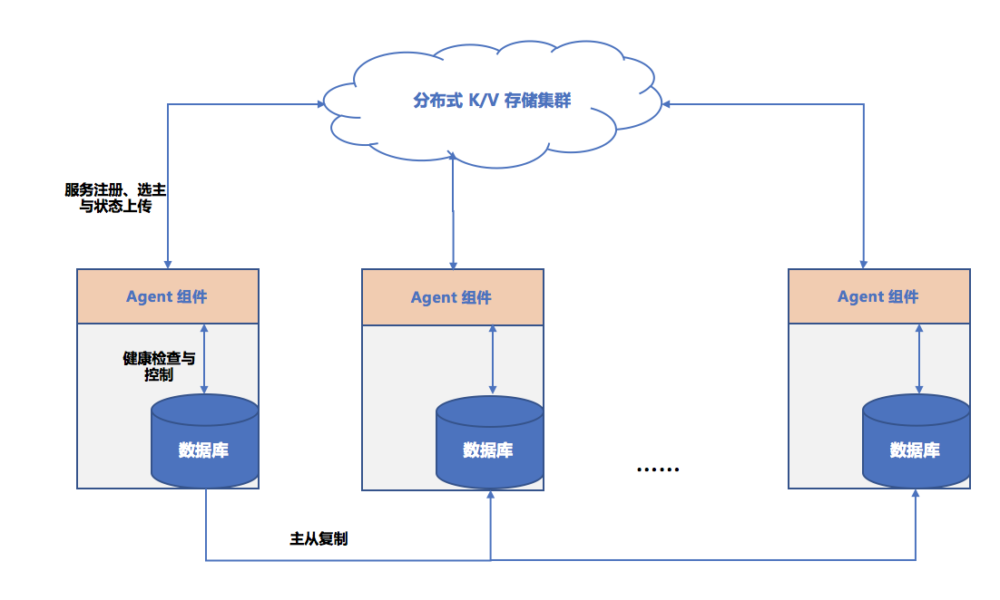

# mysql-agent

mysql-agent 是 MySQL 的守护进程，其作用是配合 DBProxy、MySQL、etcd 实现 MySQL 数据库的同城双活高可用设计。

同城双活架构图如下：

其中：
- 北京一区和北京三区部署为主备关系的两套集群
- 每个集群包括独立的LB、DBProxy、MySQL、Agent
- 跨北京一区二区三区部署一个5副本的 etcd 集群，用于配合 Agent 做 MySQL 的主备切换
- 业务通过 LB 接入本 AZ 内的一组 DBProxy，DBProxy 将业务对数据库的读写请求转发给 MySQL Master 节点，非强一致的只读请求可以转发给本 AZ 内的 MySQL Slave 节点。DBProxy 通过保持与 etcd 的连接，感知 MySQL 的主备变化。

### 功能

作为 MySQL 的守护进程，agent 实现的功能主要如下：

- 使用 etcd 的 TTL、事务机制等特性，实现选 Master 并基于 Lease 来保持 Master 身份。
- 使用 etcd 的事件订阅来实现 MySQL 的服务发现与 Master 变更通知。
- 通过 fork 子进程的方式启动 MySQL ；通过 `SET readonly`、`CHANGE MASTER` 等指令控制 MySQL 以实现主从切换。

### 流程

#### 注册流程

启动后，mysql-agent 负责把 MySQL 节点注册到 etcd，如果节点之前在 etcd 中不存在，则创建一个新的 node `<prefix>/slave/<nodeID>`，否则，更新节点信息

#### 选 master 流程
agent 启动后，去尝试写节点 `<prefix>/master` 为自己的 node_id，这个写是附带 Lease 的。只有当这个节点不存在时才能写成功。
写成功的 agent 对应的 MySQL 就是 master，将 MySQL 的 read_only 置为 0，并负责定时续 Lease。
写失败的 agent 对应的 MySQL 就是 slave，这些 agent 侦听（watch）`<prefix>/master`，在这个节点消失的时候重新执行“选 master 流程”。

#### 心跳

定期刷新节点管理的 MySQL 在 etcd 里的状态，如果节点挂了，Key `<prefix>/slave/<nodeID>` 自动在 TTL 时间后删除
MySQL 的 binlog 位点信息则放在 `<prefix>/binlog/<nodeID>` 里

#### 通知

其它服务可以 watch `<prefix>/master` 和 watch --with-prefix `<prefix>/slave` 节点来获取 MySQL 实例变化的通知

#### 解绑流程

当手动退出 mysql-agent 时，会带着对应的 MySQL 一起退出 ，`<prefix>/slave` 和 `<prefix>/master`（如果是 Master 节点）会在 Lease 到期后自动删除

#### master Failover 流程

- 当 MySQL 进程退出时，mysql-agent 的组件会检测到退出事件并尝试删除 `<prefix>/master`，只有当 `<prefix>/master` 的值是当前 `nodeID` 才会删除成功。
删除成功后，slave MySQL 的 mysql-agent 检测到 `<prefix>/master` 被删除的时间，会执行“选 master 流程”，选出另一个 master。

