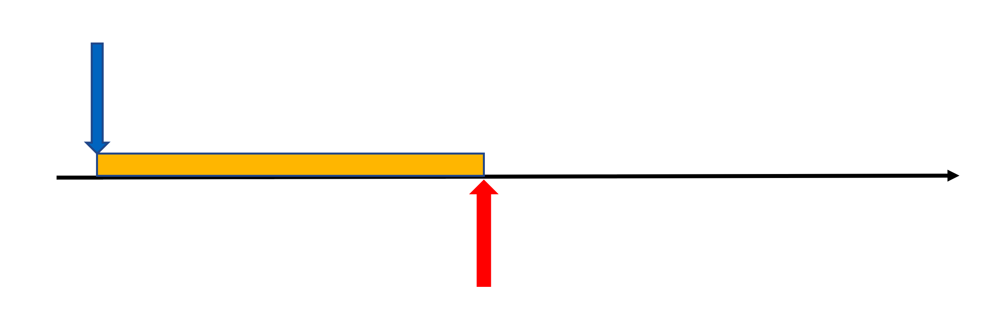
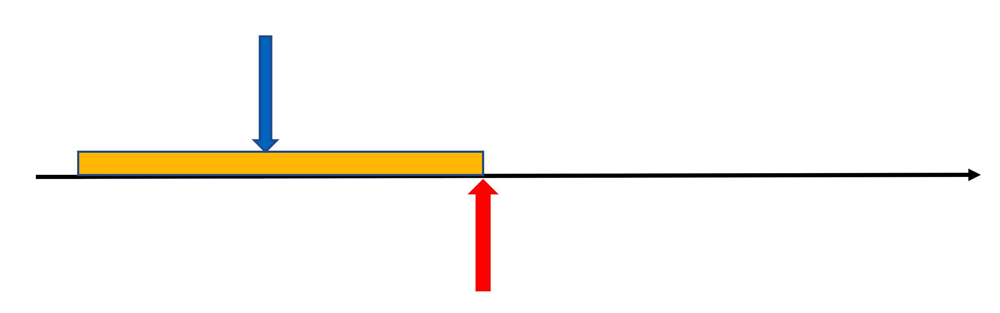
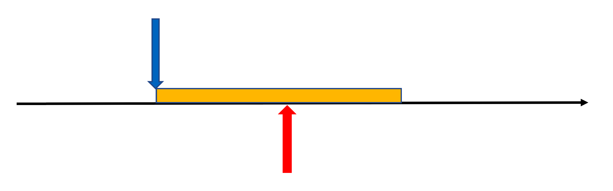
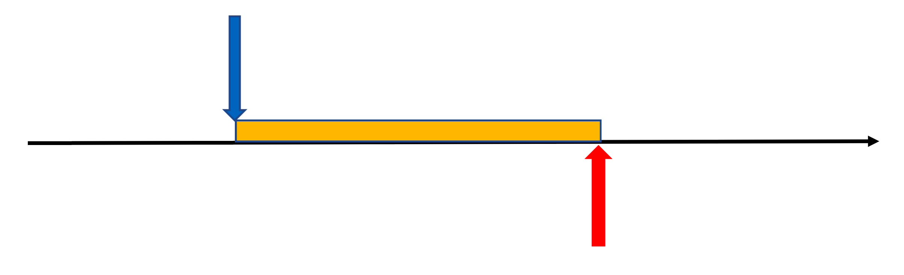
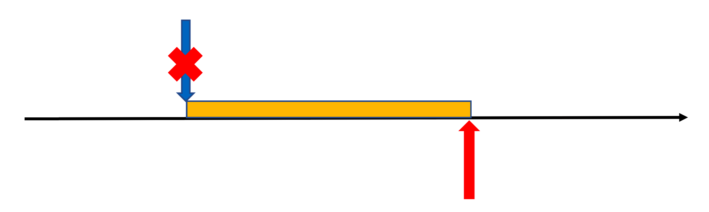
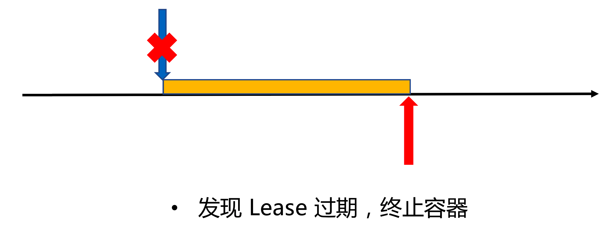

# Lease 机制介绍与 Lease 时间确定

MySQL 高可用要解决的一个问题就是如何在 Master MySQL 宕机后自动恢复集群的可写，也就是 Failover。
Failover 的机制可以保证集群内有一个主，而数据的一致性要求则需要集群中只有一个主从而保证不会出现因脑裂而导致的数据不一致。
mysql-agent 使用 Lease 机制来保证集群在任意时刻最多只有一个 Master 节点。
接下来的部分介绍了 mysql-agent 采用的 Lease 机制与实现。并且在接下来讨论了一个 Lease 长度的建议值。


### Lease 机制介绍
mysql-agent 使用的是 etcd 里面的 Lease，是相对时间的 Lease。

在每次抢主的时候，mysql-agent 生成一个 Lease 并附在 `/master` 节点上，
也就是告诉 etcd，如果我抢到主了，那么在接下来的一段时间 (Lease TTL) 内我都是主，如果在这段时间内我一直没有续 Lease，就不要继续认为我是主。
如果 agent 抢主成功，则需要去续 Lease 以证明自己还是健康的，对应的 MySQL 可以提供写服务；
如果 agent 抢主失败，则去 watch `/master` 这个节点，以便在节点消失的时候触发下一轮的选主。 

#### Lease 机制下的 Failover
如果 Master MySQL 无法提供服务，则对应的 agent 续 Lease 会停止，最长在 Lease TTL 时间后 Lease 会过期，`/master` 节点会消失，
进而 watch 这个节点的 agent 会观察到消失事件，进而触发新一轮的选主，选出新的 Master，重新提供写服务。这就是 Failover 的流程。 


#### Lease 与故障容忍时间
根据上面提到的 Failover 流程，可以看到如果 Lease 的时间设置太长，那么出现故障后恢复的时间就可能越长，
因为 Failover 要等到 Lease 过期后才会开始进行。
那么，Lease 的时间是不是越短越好呢？并不是。因为 Lease 机制是依赖于 etcd 而实现的，
所以在 etcd 出现故障和恢复的时间内，Lease 需要最大程度地不受影响。
假设 etcd 出现故障和自动恢复（比如说发生重新选主）的时间是 1s，Lease 的 TTL 和续约周期也都是 1s。
那么一旦 etcd 触发重新选主，就会造成 Lease 续约失败，导致 Lease 过期，触发 Failover 流程。
对于这种因为 etcd 而不是 MySQL 的问题导致的 Failover，我们需要尽量避免。因此 Lease 的时间也需要足够长以至于可以尽量地容忍 etcd 的故障。

那么如何确定 Lease 是 "足够长" 的呢？

采用的方法借鉴了[这篇文章](http://oceanbase.org.cn/?p=41)。假设 Lease 的 TTL 是 `L`，续 Lease 的周期时间是 `T`。
那么最坏的情况就是当 agent 去续 Lease 但是未成功时 etcd 出现故障，也就是 Lease 还剩 `L - T` 的时间就会过期。
如果这时 etcd 在 `L - T` 内可以恢复，那么这次故障就不会影响 agent。我们定义 etcd 的故障（与恢复）时间是 `D(etcd)`。
那么会有

```
D(etcd) <= L - T
```

对于 agent 来说，最长的故障时间就是 Lease 超时后 etcd 不可用，无法触发选主逻辑。等待 D 时间后可以重新选主。
那么 agent 的最长故障时间就是 

```
D(agent) <= L + D(etcd)
```

接下来把 etcd 抽象成第 `i - 1` 层，agent 抽象为第 `i` 层的系统，那么取最坏的情况，就会有
```
D(i-1) = L(i) - T(i)  
D(i) = L(i) + D(i-1)
```

消掉 `D` 这个变量，就会得到

```
L(i) = 2 * L(i - 1) – T(i - 1) + T(i)
```

如果简化一下，假设 `T(i - 1) = T(i)`，也就是各层的 Lease 续约周期相同，那么会得到

```
L(i) = 2 * L(i - 1)
```

工程实现上包含必要的误差和通信代价后，通常使用 
```
L(i) = 2.5 * L(i - 1)
```


也就是 `所有 agent 认为某个 agent 是 master 的时间（也就是 Lease 长度）` 应该是` etcd 的所有成员认定一个成员是 Leader 的时间` 的 2.5 倍。
后者的时间则可以通过 etcd 的对应参数进行调整。
简单来说，在 `v3.3.2` 的版本下，etcd 里的 `L(i - 1)` 对应配置里的 *Election Timeout*，而 `T(i - 1)` 则对应 *Heartbeat Interval*。

默认情况下，*Election Timeout* 是 1s，那么，为了容忍 etcd 故障与重启的时间，Lease 的长度要大于等于 2.5 秒。


#### 避免脑裂的方法
上面提到了 mysql-agent 使用 Failover 来保证高可用，但是不恰当的 Failover 可能会导致集群出现多个 Master 进而导致脑裂。
接下来就要介绍 mysql-agent 保证在任意时刻集群内最多只有一个 Master，进而防止脑裂的机制。

当 Failover 发生时，集群会出现一个新主，如果这个时候旧主的 MySQL 还能提供写服务，那么集群内就会出现两个可写的节点，进而可能导致脑裂。
因此，mysql-agent 需要保证在 Failover 发生时，旧的 MySQL 一定已经停止服务了。
mysql-agent 采用的方法就是在每次续 Lease 成功后在内存中更新一个时间阈值。
同时另一个 goroutine 会定期去检查这个时间阈值，如果小于等于当前时间。mysql-agent 就会强制停止 MySQL。

因为关闭 MySQL 需要一定的时间，所以这个阈值时间是要早于 Lease 真实的过期时间。
关于这个阈值时间如何确定的细节会在 "Lease 时间确定" 这一部分讨论。

下面的 6 张图片分别演示了 Lease 续约成功和失败时的处理流程。

*1. 蓝色的 goroutine 在续 Lease 成功后设置内存中 Lease 过期的阈值时间（当前时间与过期时间中间就是黄色的时间窗口，代表 agent 认为 Lease 还有效），
红色 goroutine 将在阈值时间结尾处检查。PS：横轴是时间*
 


*2. 一个 Tick 后，蓝色的 goroutine 再次续 Lease 成功*
 


*3. Lease 过期阈值和有效窗口都向后移动*
 


*4.红色的 goroutine 检查通过，休眠到下次过期时间准备下次检查*
 


*5. 蓝色的 goroutine 续 Lease 失败，阈值与窗口无法后移*
 


*6. 红色的 goroutine 再次检查，发现阈值小于等于当前时间，终止容器*
 

<br/>

*为什么 Failover 出现了，旧主的 MySQL 还可能提供服务？*

因为 Failover 发生的条件是旧的 Lease 过期，换言之是旧主续 Lease 失败。这可能在 mysql-agent 和 etcd 的网络出现隔离时产生，
也可能是 etcd 服务暂时不可用。
这时 etcd 上的 Lease 已经消失，但是旧主的 MySQL 依然可能可写。


#### 相对时间的 Lease
之前提到了，mysql-agent 使用的是 etcd 里面的 Lease，是相对时间，而不是绝对时间的 Lease。也就是说，Lease 会在一段时间后过期而不是在某个时刻过期。
这也就意味着，每个 host machine 之间的时钟误差并不是影响 Lease 的主要因素。相反，机器之间的网络延迟大小却很重要。
举一个极端的例子，我们设定 Lease TTL 为 30s，同时 mysql-agent 和 etcd 之间的网络延迟也是 30s。
这样 Master 节点每次续 Lease 都会失败，导致集群一直在重新选主。所以当机器之间的网络延迟很大时，集群内会没有 Master MySQL 节点提供写服务，但是不会出现双主。


### Lease 时间确定
mysql-agent 里面跟 master Lease 的时间有关系的参数有两个，分别是
`leader-lease-ttl` 和 `shutdown-threshold`。`leader-lease-ttl` 定义了 Lease 的 ttl，
`shutdown-threshold` 则是定义了 MySQL 关闭所耗时间的阈值。

mysql-agent 为了保证在任何时间都不会出现双主，采用的办法就是 

    在一个 master Lease 失效（包括主动删除和 Lease 过期）时，对应的 master 节点一定是不提供写服务的。
    
因为在一个 master Lease 失效之前，系统里其它的节点不会认为自己是 master；同时失效后 etcd 是事务保证只能有一个节点抢到新的 master，
所以这就保证了不会有双主产生。

上面提到了，在具体的实现上，每个 agent 里面都有两个 goroutine。
一个负责循环续 Lease 并在成功后记录 expireTS 为 `time.Now() + leader-lease-ttl - shutdown-threshold`。
另一个则是负责检查当前的时间是否超过了 expireTS，如果超过了，则执行关闭 MySQL 的逻辑。
如果我们能保证 设置的 `shutdown-threshold` 是大于 "关闭 MySQL 的逻辑" 的耗时的话，那么就能保证

    在一个 master Lease 失效（Lease 过期）时，对应的 master 节点一定是不提供写服务的。

在关闭 MySQL 的逻辑里面，有一个 wait-mysql-pid 的超时时间是 3 秒，所以 `shutdown-threshold` 要大于 3 秒，
考虑到网络延迟和留出一定的富余，一般设置为 5 秒。
而 Lease 可以根据实际的情况来进行设置。
首先根据上面 **Lease 与故障容忍时间** 里讨论的，Lease 的时间要大于等于 2.5 倍的 etcd 的 *Election Timeout*。
也就是

```
(leader-lease-ttl - shutdown-threshold) >= 2.5 * Election Timeout
```

在 etcd 默认配置下，*Election Timeout* 为 1s，也就是 `leader-lease-ttl` 至少要大于 7.5 秒。

如果是**跨机房部署**的话，建议将 Lease 设置为 15 秒到 20 秒的长度，这样可以容忍更长的网络延迟与中断时间。这时一个推荐的值是


| 配置项              | 建议值  | 
| --------           | :----- |
| leader-lease-ttl   | 20     | 
| shutdown-threshold | 5      | 


这样，如果 etcd 和 mysql-agent 之间的网络中断可以在 15 秒内恢复，不会触发 MySQL 集群主从的改变，也就是对业务无影响。


如果是**单机房部署**的话，因为网络相对较稳定，Lease 可以适当减小，以在更短的时间内恢复故障，这个值设置为 10 即可。

| 配置项              | 建议值  | 
| --------           | :----- |
| leader-lease-ttl   | 10     | 
| shutdown-threshold | 5      | 


### 总结
这篇文章介绍了 agent 用来实现 MySQL Failover 的 Lease 机制，之后介绍了通过调整 Lease 来实现 `容忍 etcd 故障` 和 `避免脑裂` 的方法。
最后针对**跨机房部署**和**单机房部署**两种情况，给出了建议的 Lease 长度。

对于跨机房部署，Lease 要适当地设长一些，以便可以容忍机房间的网络抖动；对于单机房部署，Lease 可以适当地设短，以获得更快的 Failover。
另外需要注意，建议值是基于 etcd 的 *Election Timeout* 的默认值，如果修改 *Election Timeout*，则 Lease 的长度也可能需要进行相应调整。