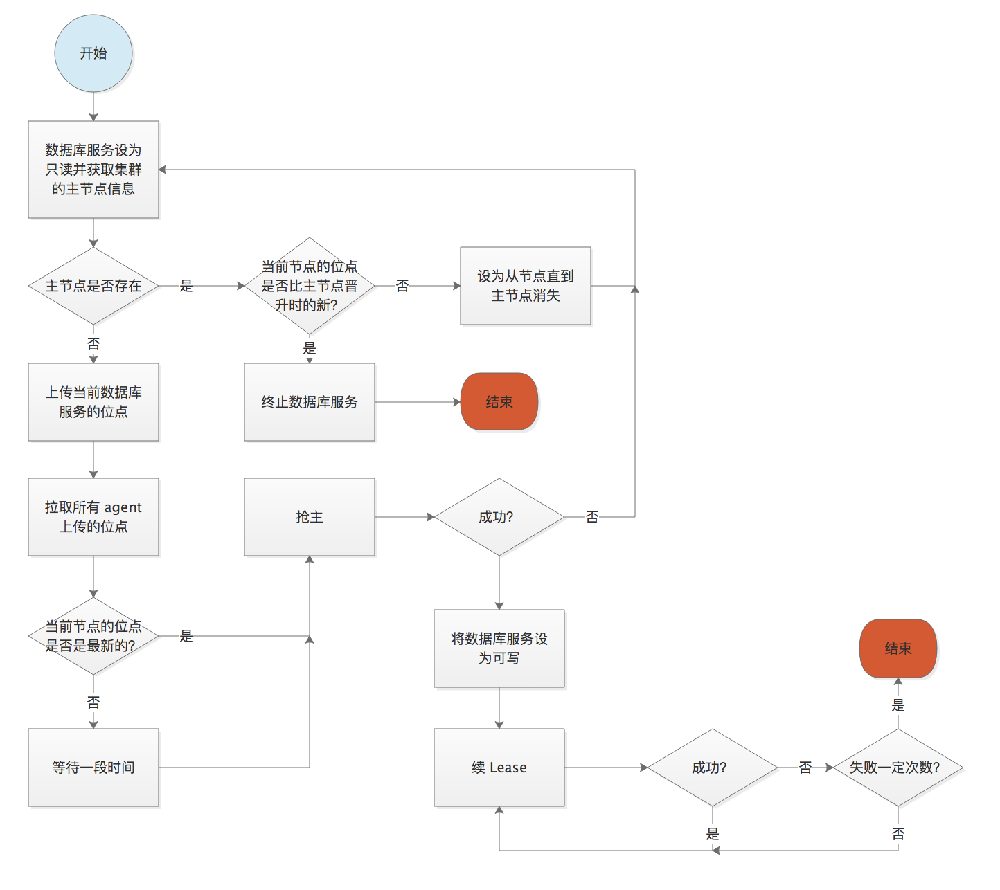

# 一主多从

为了增强 MySQL 集群的可用性，mysql-agent 从 2.0 版本起支持搭建一主多从的 MySQL 集群。
同时一主多从的拓扑结构也引入了一些新的问题。比如：
- 在 Master 节点不可用时如何选出最新的 Slave 作为新主？

下面就会介绍在 2.0 版本里，一主多从引入的新问题是如何解决的。

### Failover 时选出最新的从库作为新主

#### 通过 GTID 确认最新的从库
最新的从库，指的就是数据和主库最接近的从库。我们采用比较 GTID 的方式来确认从库数据和主库数据的关系。
比如如下的一主两从的集群（A 是主库，B、C 是从库）

|     MySQL         | GTID  | 
| --------           | :----- |
| A  | A:1-20     | 
| B | A:1-18      | 
| C | A:1-20      |

那么最新的丛库就是 C。

#### 选主时加入 GTID 的上传和拉取
为了使每个 agent 节点都知道自己是否是最新的节点，我们在选主之前加入了以下的步骤：
1. 节点上传自己的 gtid 到 etcd
2. sleep，等待其它节点上传完毕
3. 每个节点从 etcd 上拉取所有节点的 gtid
4. 在本地进行比较，最新的节点立刻抢主
5. 不是最新的节点会 sleep 后去抢主，防止最新的节点挂掉

这样就可以保证在网络正常（无故障，延迟小）的情况下，最新的从库是一定可以成为新的主库的。

#### 如果网络出现延迟
如果在选主的时候某个节点的网络出现延迟，可能会导致在它上传自己的位点到 etcd 之前，其它的节点就拉取了所有节点的位点并进行了比较。
如果这个网络延迟的节点又恰好是最新的从库的话，那么这个节点就不能 `CHANGE MASTER` 到新的主库了。因为这将导致数据的不一致。

这个延迟可能出现在上传位点、拉取位点、抢主，甚至是再早的 watch 到旧主消失事件的延迟。这些延迟，如上面介绍的，都可能导致不是最新的节点被选为新主。
那么当这个节点网络恢复后，就需要加入一些判断来确认它是否能加入集群。下面是出现单节点延迟的最坏情况。

|     MySQL | GTID  |GTID |GTID|
| --------  | :----- | :----- | :----- |
|A|A:1-10|X (宕机)|X (宕机)|
|B|A:1-9|A:1-9,B:1-10|A:1-9,B:1-10|
|C|A:1-10|A:1-10 (未收到 watch 事件)|X (确保无法重新加入集群)|

为了确保 C 无法加入集群，我们在节点**选主成功后**和**选主失败后**分别加入以下逻辑。
* 如果选主成功，则在接收写请求之前上传当前位点
* 如果选主失败，则在 `CHANGE MASTER` 之前先拉取新主上传的位点并与自己的位点比较。
如果自己的位点更新，则停止服务；否则正常 `CHANGE MASTER`

#### 如果延迟使某个节点错过了多次选举
上面提到的是错过一次选举的情况，但是如果一个节点因为网络问题而导致错过多次选举，比较 GTID 就会变得比较复杂。
因此我们引入了 term 机制来简化这个问题。term 是一个全局的 int 类型的数字，只会单调递增。改变它的规则如下：
* 新主负责将全局的 term+1
* 从节点在获取主节点信息的时候也要获取全局的 term，如果校验通过则将这个 term 更新为自己本地的 term
* 校验是指：
    * 本地的 term 不为 0 时，本地的 term 和全局 term 相等，不需校验 GTID，直接加入集群作为从库
    * 本地的 term 不为 0 时，本地的 term 比全局 term 小 1 时，需要按照上一节的逻辑比较 GTID
    * 本地的 term 为 0 时，不需校验 GTID，直接加入集群。这个也是新节点加入集群的逻辑。

在有 term 存在的情况下，选主的一种情况如下所示：

|MySQL |term = 1|term = 2|term = 3|term = 3|
|---| :--- | :--- | :--- |:--- |
|A|A:1-10|X (宕机)|X (宕机)|X (宕机)|
|B|A:1-9|A:1-9,B:1-10|X (宕机)|X (宕机)|
|C|A:1-10|A:1-10 / term=1 (未收到 watch 事件)|A:1-10 / term=1 (未收到 watch 事件)|X(term 过小)|
|D|A:1-9|A:1-9,B:1-10|A:1-9,B:1-10,D:1-10|A:1-9,B:1-10,D:1-10|

整体的流程如下图所示

