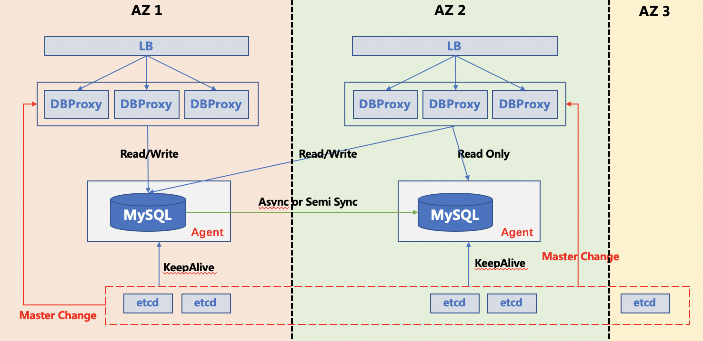
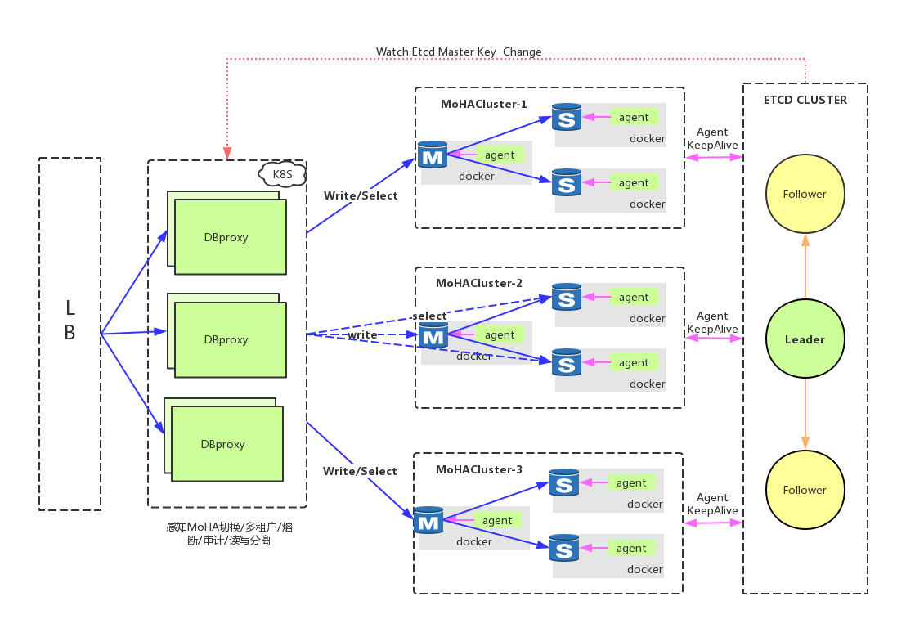

MoHA部署
=================

   * [MoHA 部署](#internal-mechanism-on-xenon)
      * [概览](#overview)
      * [1 配置信息相关介绍](#1-配置信息相关介绍)
      * [2 ETCD部署](#2-ETCD部署)
      * [3 MoHA实例部署](#3-MoHA实例部署)
      * [4 计划内切换](#4-计划内切换)
      * [5 计划外切换](#5-计划外切换)
      * [6 haproxy接入](#6-haproxy接入)
      * [7 监控](#7-监控)
      * [8 mobike MoHA 架构](#8-mobike-MoHA-架构)


## 概览
通过自动的 master 失败检测和秒级的主从切换，MoHA 提供了跨数据中心的 MySQL 集群的高可用（HA）。它的特点包括：

- __高可用__
    MoHA 对 MySQL 的失败检测和 failover 策略可以保证 MySQL 集群的高可用

- __无脑裂__
    MoHA 采用 lease 机制，通过配置合理的 lease 长度，可以确保 MySQL 集群无脑裂

- __跨数据中心__
    MoHA 采用 etcd 实现服务的注册和发现，避免了 VIP 的局限，可以搭建**跨数据中心**的 MySQL 集群

- __一主多从__
    MoHA 支持搭建一主多从的 MySQL 集群，并且在 Failover 时会指定数据最新的从库作为新主

- __单主模式__
    在集群内只有一个 MySQL 节点存活时，即使 MoHA 与 etcd 通信中断，单节点 MySQL 依然可以提供服务。
    单主模式支持自动进入和自动退出

- __在线主从切换__
    MoHA 支持通过API实现在线的主从切换，安全的将当前运行的master切换到新master上

- __监控__
    MoHA 提供监控针对agent以及数据库运行状态的API接口，可以方便对接公司数据库管理平台，实现Paas化监控




#### 1 配置信息相关介绍
#### 1.1 etcd相关配置
|dockername|IPAddress|EtcdName|MachineCPU|MachineMem|Machine|SystemVersion|
|------|---------|------------------|-----|------|-------|-------|
|etcd1|127.0.0.1|production-etcd-1|4核+|8G+|SSD100G+|Centos 7.0+|
|etcd2|127.0.0.2|production-etcd-2|4核+|8G+|SSD100G+|Centos 7.0+|
|etcd3|127.0.0.3|production-etcd-3|4核+|8G+|SSD100G+|Centos 7.0+|
> **注**：
>
> - 线上环境建议5节点部署，并且不要和其它业务混合部署，防止其它业务负载攀升，造成etcd节点不稳定
> - 如果数据库采用同机房部署方式，推荐etcd集群和数据库集群同网段
> - 如果数据库采用两地三中心部署方式，推荐etcd集群同样使用两地三中心部署（最佳实践:AZ1:2,AZ2:2,AZ3:1 AZ3为异地机房）
> - 推荐使用docker-compose部署方式,并使用高版本操作系统

#### 1.2 MoHA相关配置
|dockername|IPAddress|MoHA Name|MachineCPU|MachineMem|Machine|SystemVersion|
|------|---------|------------------|-----|------|-------|-------|
|3306_moha20|127.0.0.4|3306_moha20|4核+|8G+|SSD100G+|Centos 7.0+|
|3306_moha20|127.0.0.5|3306_moha20|4核+|8G+|SSD100G+|Centos 7.0+|
|3306_moha20|127.0.0.6|3306_moha20|4核+|8G+|SSD100G+|Centos 7.0+|
> **注**：
>
> - 配置表中数据库机器CPU/MEM/Storage 应根据线上数据库配置来定；MoHA进程占用的资源很小
> - MoHA支持单机房部署与跨机房部署
> - MoHA推荐主从节点总数量大于2，仅部署一个节点时，进入单主模式
> - MoHA支持单机多实例部署方式，通过端口区分不通实例组
> - 数据库数据文件目录映射到物理机，容器故障不影响数据文件
> - 推荐使用docker-compose部署方式,并使用高版本操作系统

### 2 ETCD部署
#### 2.1 docker 安装及启动
```
yum install -y docker docker-compose  && systemctl start docker
```
#### 2.2 pull etcd 镜像
```
docker pull quay.io/coreos/etcd:v3.2.18
```
#### 2.3 etcd docker-compose 配置文件编写
```
#only first etcd configure demaon
---
version: '3.2'

services:
  etcd1:
    image: quay.io/coreos/etcd:v3.2.18
    #suggest etcd version > V3.0
    container_name: production-etcd-1
    restart: always
    network_mode: host
    environment:
      - ETCD_NAME=production-etcd-1
      - ETCD_LISTEN_CLIENT_URLS=http://0.0.0.0:2379
      - ETCD_DATA_DIR=/var/lib/etcd/default.etcd
      - ETCD_LISTEN_PEER_URLS=http://0.0.0.0:2380
      - ETCD_QUOTA_BACKEND_BYTES=10737418240
      #etcd  backend db max size
      - ETCD_INITIAL_ADVERTISE_PEER_URLS=http://127.0.0.1:2380
      - ETCD_ADVERTISE_CLIENT_URLS=http://127.0.0.1:2379
      - ETCD_INITIAL_CLUSTER=production-etcd-1=http://127.0.0.1:2380,production-etcd-2=http://127.0.0.2:2380,production-etcd-3=http://127.0.0.3:2380
      - ETCD_INITIAL_CLUSTER_TOKEN="moha-group-etcd"
      - ETCD_INITIAL_CLUSTER_STATE=new
      - ETCD_AUTO_COMPACTION_RETENTION=2 #hour
    logging:
      driver: "json-file"
      options:
        max-size: "50m"
        max-file: "10"
    volumes:
      - /data/etcd_database:/var/lib/etcd
    ports:
      - 2379:2379
      - 2380:2380
```
> **注**：
>
> - 推荐使用etcd官方镜像
> - 新建集群是ETCD_INITIAL_CLUSTER_STATE设置为new，新增节点时，ETCD_INITIAL_CLUSTER_STATE设置为existing
> - Volumes中需要新建本地目录，并映射到/var/lib/etcd中
> - 推荐设置ETCD_AUTO_COMPACTION_RETENTION，该参数作用：mvcc键值存储的自动压缩


#### 2.4 启动etcd集群
登录到每台etcd机器，依次执行启动命令
```
#启动
docker-compose -f sys_etcd_compose.yml up -d
#查看是否启动成功
docker ps
```
#### 2.5 查看etcd集群状态信息
```
[root@production-database-controller ~]# etcdctl --endpoints="http://127.0.0.1:2379,http://127.0.0.2:2379,http://127.0.0.3:2379" endpoint status --write-out=table
+------------------------+------------------+---------+---------+-----------+-----------+------------+--------------------+--------+
|        ENDPOINT        |        ID        | VERSION | DB SIZE | IS LEADER | RAFT TERM | RAFT INDEX | RAFT APPLIED INDEX | ERRORS |
+------------------------+------------------+---------+---------+-----------+-----------+------------+--------------------+--------+
|  http://127.0.0.1:2379 | e150377084e7269c |  3.2.18 |   25 kB |     false |         2 |        171 |                  0 |        |
|  http://127.0.0.2:2379 | 70273bc2b66e5a6d |  3.2.18 |   25 kB |     false |         2 |        171 |                  0 |        |
|  http://127.0.0.3:2379 | 124af500f66e3f4e |  3.2.18 |   25 kB |      true |         2 |        171 |                  0 |        |
+------------------------+------------------+---------+---------+-----------+-----------+------------+--------------------+--------+
```
#### 2.6 创建用户与赋予权限
```
#add user
etcdctl --endpoints="http://127.0.0.1:2379,http://127.0.0.2:2379,http://127.0.0.3:2379"  user add "root:D1hmWnE29PU4wJNr"
#add role
etcdctl --endpoints="http://127.0.0.1:2379,http://127.0.0.2:2379,http://127.0.0.3:2379"  role add root
#grant root to moha
etcdctl --endpoints="http://127.0.0.1:2379,http://127.0.0.2:2379,http://127.0.0.3:2379" user grant-role root root
#enable auth
etcdctl --endpoints="http://127.0.0.1:2379,http://127.0.0.2:2379,http://127.0.0.3:2379" auth enable
```

#### 2.7 读写测试
```
export ETCDCTL_API=3
etcdctl --endpoints="http://127.0.0.1:2379,http://127.0.0.2:2379,http://127.0.0.3:2379" --user root:D1hmWnE29PU4wJNr put /mobike mobike123
OK
etcdctl --endpoints="http://127.0.0.1:2379,http://127.0.0.2:2379,http://127.0.0.3:2379" --user root:D1hmWnE29PU4wJNr get /mobike
/mobike
mobike123
```

#### 2.8 监控增加
```
#参考官方介绍，并增加监控告警策略
https://coreos.com/etcd/docs/latest/op-guide/monitoring.html
```

### 3 MoHA实例部署
#### 3.1 下载安装镜像
下载MoHA代码，本地编译moctl下的conf.go代码，参考conf.toml修改配置文件，生成docker-compose/
```
docker push moiot/moha:v2.6.1
```

#### 3.2 下载源代码，并编译moha/moctl/conf.go 
```
git clone https://github.com/moiot/moha.git
cd moha/moctl && go build conf.go 
```
#### 3.3 修改demon配置文件
```
[mysql]
hostaddress     = "127.0.0.4"
port            = "3306"
instancename     = "moha_github"
bufferpool      = "1G"
sqlmode      = "STRICT_TRANS_TABLES,NO_ZERO_IN_DATE,NO_ZERO_DATE,ERROR_FOR_DIVISION_BY_ZERO,NO_AUTO_CREATE_USER,NO_ENGINE_SUBSTITUTION"
datadir      = "/data1/mysql/"

[agent]
hostaddress = "127.0.0.4"
port        = "3306"
instancename = "moha_github"
proxyname = "moha_kaiyuan"
etcdurl = "http://127.0.0.1:2379,http://127.0.0.2:2379,http://127.0.0.3:2379"
etcduser = "root"
etcdpasswd = "D1hmWnE29PU4wJNr" #your etcd passwd
agentuser = "agent"
agentpasswd = "youragentpasswd"
mysqlrepluser = "repl"
mysqlreplpasswd = "yourreplpasswd"
datadir      = "/data1/mysql/"

[docker]
port        = "3306"
instancename = "moha_github"
version  = "v2.6.1"
datadir      = "/data1/mysql/"
agentuser = "agent"
agentpasswd = "youragentpasswd"
mysqlrepluser = "repl"
mysqlreplpasswd = "yourreplpasswd"
mysqlrootpasswd = "yourrootpasswd"
```
> **注**：
>
> - 测试过程中，一定要将hostaddress修改为服务器内网IP地址
> - 各项配置按需修改，部分参数在代码中已经hardcode,如果需要修改，可以直接修改conf.go中的参数或者修改生成后的配置文件
> - 配置文件生成也可参考etc/docker-compose/deploy-example 中的例子自行编写
> - 企业实战中，建议开发数据库管理平台，在页面中进行各项参数配置并生成配置文件，通过salt调度部署新实例

#### 3.4 配置文件生成
配置文件生成在/etc目录下，启动前可查看生成的各项配置是否符合预期
```
./conf -config conf.toml
```
#### 3.5 MoHA 节点启动
```
docker-compose -f /etc/3306_docker-compose.yml up -d
```

#### 3.6 查看MoHA节点是否启动成功
```
#查看容器是否正常启动
docker ps
#查看mysql 是否正常启动
ps -ef | grep mysqld
#查看supervise日志是否正常
tail -fn 20 ${datadir}/${port}_agent/supervise.log
[3306_agentlog]# tail -fn 20 supervise.log
2019-01-15 20:50:37 INFO  supervise/supervise.c:221: epoll_wait returns 1 count
2019-01-15 20:50:37 INFO  supervise/supervise.c:263: /agent/mysql-agent is still alive, from detect_child_alive
2019-01-15 20:50:38 INFO  supervise/supervise.c:221: epoll_wait returns 1 count
2019-01-15 20:50:38 INFO  supervise/supervise.c:263: /agent/mysql-agent is still alive, from detect_child_alive
#查看agent日志是否成功
[3306_agentlog]# tail -fn 20 mysql-agent.log
2019/01/15 20:51:06.563 agent/registry.go:80 [info] register slave/127.0.0.4:3306 to etcd with ttl 10
2019/01/15 20:51:10.564 agent/registry.go:80 [info] register slave/127.0.0.4:3306 to etcd with ttl 10
2019/01/15 20:51:14.562 agent/registry.go:80 [info] register slave/127.0.0.4:3306 to etcd with ttl 10
2019/01/15 20:51:16.061 agent/single_point.go:188 [info] server 127.0.0.4:3306 is still in single point master mode
#仅增加一个节点时，数据库进入单主模式，不会发生切换动作
```

#### 3.7 etcd中 MoHA集群的展现
```
 etcdctl --endpoints="http://127.0.0.1:2379,http://127.0.0.2:2379,http://127.0.0.3:2379" --user root:D1hmWnE29PU4wJNr get /  --prefix
 /dbproxy/moha_kaiyuan/ks_cfg/nodes/3306_moha_github/election #目录下记录切换相关信息
 /dbproxy/moha_kaiyuan/ks_cfg/nodes/3306_moha_github/master #记录当前实例主库信息
 127.0.0.2:3306
 /dbproxy/moha_kaiyuan/ks_cfg/nodes/3306_moha_github/slave/127.0.0.2:3306 #记录当前MoHA实例组所有的节点
 {"NodeID":"127.0.0.2:3306","InternalHost":"127.0.0.2:3306","ExternalHost":"127.0.0.2:3306","LatestPos":{"File":"","Pos":"","GTID":"","UUID":""}}
 /dbproxy/moha_kaiyuan/ks_cfg/nodes/3306_moha_github/slave/127.0.0.3:3306 #记录当前MoHA实例组所有的节点
 {"NodeID":"127.0.0.3:3306","InternalHost":"127.0.0.3:3306","ExternalHost":"127.0.0.3:3306","LatestPos":{"File":"","Pos":"","GTID":"","UUID":""}}
```

### 4 计划内切换
agent 提供以下的 HTTP 服务
* `/changeMaster` 主从切换
* `/setReadOnly` 将当前节点的 MySQL，如果是 Master 的话，设为只读
* `/setReadWrite` 将当前节点的 MySQL，如果是 Master 的话，设为可读写
* `/setOnlyFollow?onlyFollow=true/false` 设置为true时，不参与抢主；设置为false时，参与选主

#### 4.1 计划内切换
编译moha/moctl目录下的switch.go
主从切换需要先执行 `/setReadOnly`，如果可以进行主从切换，则执行 `/changeMaster`，
否则执行 `/setReadWrite` 使集群恢复可读写。
```
# ./switch -instanceport 3306 #需要在实例所在的服务器运行
127.0.0.2:3306 master running thread is below 100,check continue
127.0.0.3:3306 Slave_IO_Running and Slave_SQL_Running thread is ok,check continue
127.0.0.3:3306 Seconds_Behind_Master is below 20s,check OK
127.0.0.3:3306 slave is approve master,check OK
```
### 5 计划外切换
- 编译moha/moctl目录下的recovery.go
- 在故障主机上Myflash `https://github.com/Meituan-Dianping/MyFlash`
- 在故障主机运行recovery -instanceport 3306 -binlogbackupdir "/data/backup/binlog"
- recovery会生成一个padder.toml的文件，修改文件中需要补偿的数据库名称
- 运行./padder -config padder.toml 

### 6 haproxy接入
#### 6.1 安装haproxy
```
yum -y install haproxy
```
#### 6.2 编写配置文件
```
#write haproxy 
global
    maxconn 100

defaults
    log global
    mode tcp
    retries 2
    timeout client 30m
    timeout connect 4s
    timeout server 30m
    timeout check 5s

listen stats
    mode http
    bind *:7000
    stats enable
    stats uri /

listen mysql
    bind *:5000
    option httpchk /masterCheck
    http-check expect status 200
    default-server inter 3s fall 3 rise 2 on-marked-down shutdown-sessions
    server mysql-node-1 127.0.0.4:3306 maxconn 100 check port 13306
    server mysql-node-2 127.0.0.5:3306 maxconn 100 check port 13306
    server mysql-node-3 127.0.0.6:3306 maxconn 100 check port 13306
# read haproxy
global
    maxconn 100

defaults
    log global
    mode tcp
    retries 2
    timeout client 30m
    timeout connect 4s
    timeout server 30m
    timeout check 5s

listen stats
    mode http
    bind *:5000 #diff machine
    stats enable
    stats uri /

listen mysql
    bind *:5000
    option httpchk /slaveCheck
    http-check expect status 200
    default-server inter 3s fall 3 rise 2 on-marked-down shutdown-sessions
    server mysql-node-1 127.0.0.4:3306 maxconn 100 check port 13306
    server mysql-node-2 127.0.0.5:3306 maxconn 100 check port 13306
    server mysql-node-3 127.0.0.6:3306 maxconn 100 check port 13306
```
#### 6.3 启动haproxy
```
haproxy -f /etc/haproxy.cfg 
```
#### 6.4 验证
```buildoutcfg
mysql -u root -h 127.0.0.1 -P 5000
#验证m-haproxy上的请求是否发送到主库，s-haproxy上的读请求是否发送到slave 相当于dns的读写域名

```
### 7 监控
agent 内置了 [pmm-client](https://www.percona.com/doc/percona-monitoring-and-management/index.html)。
如果已有 pmm-server 的话可以执行  
```
	docker exec <agent-container> pmm-admin config --server <pmm-server-ip>
	docker exec <agent-container> pmm-admin add mysql --user <username> --password <password> <mysql-instance-name>
```
将 MySQL 加入 pmm-server 的监控。
如果没有 pmm-server 可以参考 [etc/docker-compose/docker-compose.yaml](../etc/docker-compose/docker-compose.yaml)
里面的 `pmm-server` 进行搭建。

agent 的监控可以通过修改 pmm-server 内的 prometheus 配置进行添加。具体步骤可以参考
[Makefile](../Makefile) 的 `monitor` 部分。

### 8 mobike MoHA 架构

> **注**：
>
> - 建议单独运行一套监控程序读取etcd中MoHA的节点信息，通过MoHA集群的主从切换事件，实现报警以及主从切换后信息
> - 建议通过Pass化的管理，生成conf的配置文件，通过salt远程调用，实现自动化部署
> - 建议通过golang封装备份脚本，实现定时备份以及备份上传到远程存储，解决备份的环境依赖问题

