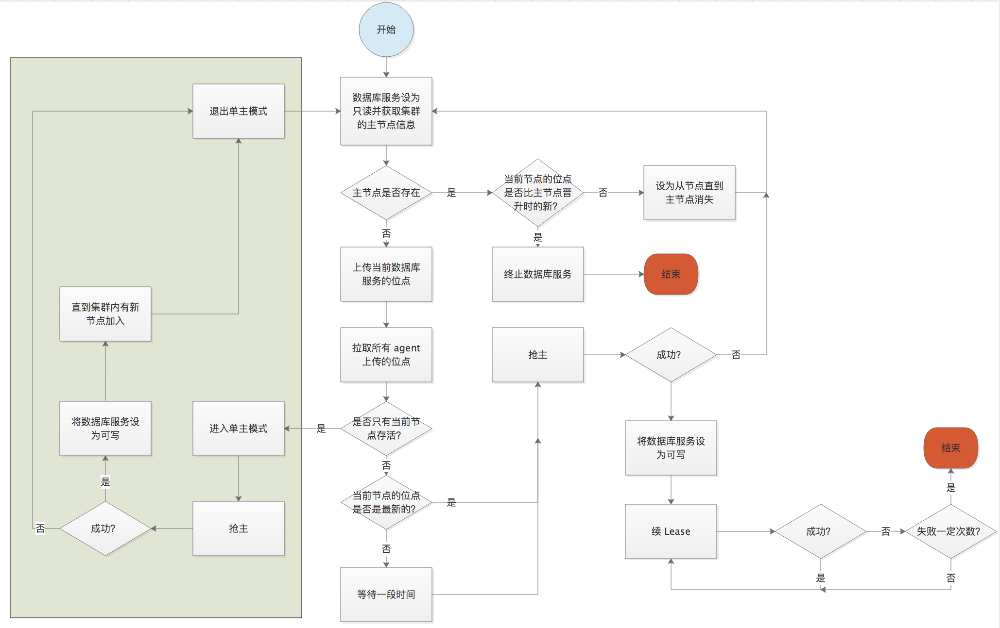

# 单主模式
在介绍 agent 如何应对与 etcd 集群之间的网络隔离时，提到过解决方案是：
如果主节点续 Lease 失败，则在 Lease 失效之前关闭 MySQL 服务，避免产生双主。

接下来设想这种场景，一个一主两从的集群，出现了两次 agent 和 etcd 之间的网络隔离。
这导致两个依次选出来的主节点依次停止服务，这时集群内只有一个 MySQL 作为主节点提供服务。
如果这时再出现一次网络隔离，那么这个唯一的主节点也会停止服务。这就导致整个 MySQL 集群不可用。
为了避免这种不可用的情况发生，集群在只有一个节点存活的时候会将 agent 和 etcd 解耦。这就是"单主模式"。

### 如何解耦
之前提到过，主节点使用 Lease 机制来维持 etcd 上 `/master` 是有效的。
解耦的方法就是在写 `/master` 时写成永久存在的节点，同时不去续 Lease。
这样即使 etcd 和 agent 之间再出现网络隔离，也不会停止 agent 对应的 MySQL 服务。 

### 进入单主模式
进入单主模式的前提是 agent 认为集群内只有自己是存活的。采用的办法是
1. agent 在选主上传位点的同时也去上传自己的 term
2. agent 在从 etcd 上拉取所有位点时也去拉取所有节点上传的 term
3. 每个 agent 比较自己的 term 与其它节点的 term 大小
    1. 如果存在其它节点的 term 跟自己的 term 相等，说明集群内不止自己是存活的，进入正常选主的逻辑
    2. 如果其它节点的 term 都比自己的小，说明集群内可能只有自己是存活的，进入单主模式的选主 

### 退出单主模式
退出单主模式的条件是 agent 确认集群内不止有自己。采用的办法就是 watch `/slave`，也就是注册节点。
当 `/slave` 里出现超过一个节点时，就可以退出单主模式。退出的逻辑就是主节点按照正常选主逻辑重新抢主，恢复 Lease 机制。

### 加入单主模式的选主流程图

